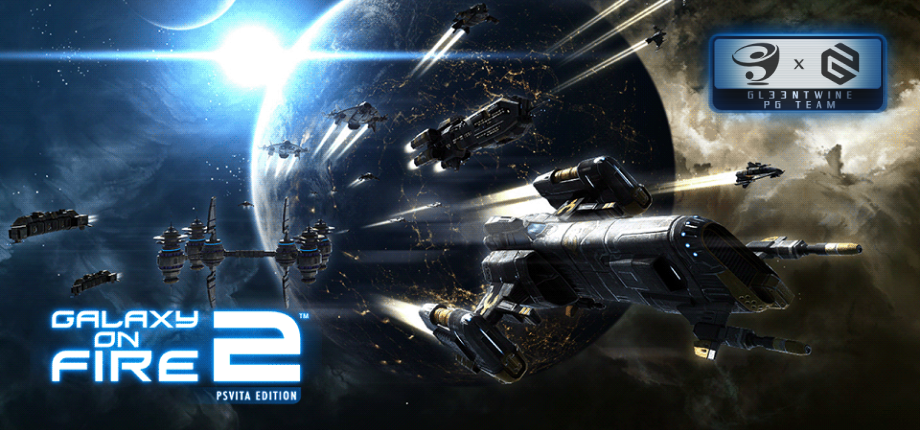

<h1 align="center">
<br>
Galaxy on Fire 2 · PS Vita Port
</h1>
<p align="center">
  <a href="#port-features">Port features</a> •
  <a href="#setup-instructions-for-players">How to install</a> •
  <a href="#known-issues">Known issues</a> •
  <a href="#build-instructions-for-developers">How to compile</a> •
  <a href="#credits">Credits</a> •
  <a href="#license">License</a>
</p>

Galaxy On Fire 2 is a spaceflight simulation video game. The game revolves
around spaceflight and space combat, set in a universe with multiple star
systems. Players can fight enemies/friends, mine for ore, trade commodities,
and complete jobs such as freelance missions. 

This repository contains a loader of **the Android release of Galaxy on Fire 2**,
based on the [Android SO Loader by TheFloW][gtasa_vita].
The loader provides a tailored, minimalistic Android-like environment to run
the official ARMv6 game executable on the PS Vita.

Note, this is **not Galaxy on Fire 2: HD Edition**, so this port unfortunately
does not have the Valkyrie and Supernova DLCs.

Disclaimer
----------------

**Galaxy on Fire 2 and ABYSS® are registered trademarks of FISHLABS
Entertainment GmbH.**

© 2010 Designed and developed by FISHLABS Entertainment GmbH, powered by
ABYSS® Game Engine. All rights reserved. Further information is available at
www.fishlabs.net

The work presented in this repository is not "official" or produced or
sanctioned by the owner(s) of the aforementioned trademark(s) or any other
registered trademark mentioned in this repository.

This software does not contain the original code, executables, assets, or
other non-redistributable parts of the original game product. The authors of 
this work do not promote or condone piracy in any way. To launch and play
the game on their PS Vita device, users must possess their own legally obtained
copy of the game in form of an .apk file.

Port Features
----------------

This port is brought to you in cooperation with [PG Team](https://pgtmp.gitbook.io/pgbook/).
There are numerous improvements done by them that you can optionally enable
in the configurator:

### HD Textures Patch
- HD retexture of planets. [Example comparison.](screenshots/hd.png)
- Updated the logo on boot and the main game logo.
- Replaced Xperia Play with the Vita in the controls settings illustrations.
- Updated the localizations accordingly.
- Added authors to credits.

### CyberDown's rebalance mod port

- Almost all characteristics of items, ships and requirements for blueprints
have been changed. For example, for the Linear Booster, the run time is increased,
but the efficiency is reduced. Missing slots have been added to ships,
and some blueprints require additional material.
- The pricing policy has changed (only for the version with prices):
    - Prices are based on HD and Original versions.
    - Some items have become cheaper, while others have become more expensive
    according to the established characteristics of the items.
    - The spread of prices has increased significantly.
    - Significantly increased prices for ships.

**Note:** there are two versions of this patch provided: the one that keeps
the old original game prices, and the one with more challenging pricing.

The modification significantly complicates the gameplay, and is recommended for
playing on the Expert difficulty level!

**IMPORTANT:** you can NOT apply this patch to an already started game, there
is a big chance of corrupting your saves this way. With this patch enabled,
you must only start a new game.

Setup Instructions (For Players)
----------------

In order to properly install the game, you'll have to follow these steps
precisely:

- Install [kubridge][kubridge] and [FdFix][fdfix] by copying `kubridge.skprx`
and `fd_fix.skprx` to your taiHEN plugins folder (usually `ur0:tai`) and adding
two entries to your `config.txt` under `*KERNEL`:

```
  *KERNEL
  ur0:tai/kubridge.skprx
  ur0:tai/fd_fix.skprx
```

> ⚠️ Don't install `fd_fix.skprx` if you're using the rePatch plugin!

> ⚠️ Unlike the Dead Space Mobile port, there is no requirement for
`kubridge.skprx` version. Any version should work.

- Make sure you have `libshacccg.suprx` in the `ur0:/data/` folder on your
console. If you don't, use [ShaRKBR33D][shrkbrd] to get it quickly and easily.

- <u>Legally</u> obtain your copy of Galaxy on Fire 2 in form of an `.apk` file.
Make sure that your game is **v1.0.4**. Other versions are NOT supported.

    - If you have it installed on your phone, you can 
        [get all the required files directly from it][unpack-on-phone]
        or by using any APK extractor you can find on Google Play.

> ℹ️ Verify that your build is exactly the correct one using **sha1sum** (can also
> be found as an online tool). sha1sum for `lib/armeabi/libgof2.so`
> must be `66F317C81795FDF4C8D40D9E6E5C3BF85D602904`

- Transfer your `.apk` file onto your Vita. The resulting path has to be as
follows: `ux0:data/gof2/GalaxyOnFire.apk`

- Install `GalaxyOnFire2.vpk` (from [Releases][releases]).

- **Optional but strongly recommended**: Install [PSVshell][PSVshell]
to overclock your device to 500Mhz.

- Don't forget that the port has a companion configurator app that you can launch
from Live Area by clicking on "Configurator" button in the bottom of the page.

Known Issues
----------------

1. "Where is it" button on the map may not work the first time you click it
and you'd need to go back to the previous menu and try again.
2. Occasionally, there can be some glitches in dialogues, such as
auto-skipping some phrases or Next/Prev buttons not working.

Build Instructions (For Developers)
----------------

In order to build the loader, you'll need a [vitasdk](https://github.com/vitasdk)
build fully compiled with softfp usage. The easiest way to obtain one is
following the instructions on https://vitasdk.org/ while replacing the URL in
this command:
```bash
git clone https://github.com/vitasdk/vdpm
```
Like this:
```bash
git clone https://github.com/vitasdk-softfp/vdpm
```

Almost all the required libraries should get installed automatically if you
follow the installation process from https://vitasdk.org/. Additionally, you'll
need to replace default OpenSLES with [this fork](https://github.com/Rinnegatamante/opensles)

After all these requirements are met, you can compile the loader with the
following commands:

```bash
cmake -S. -Bbuild -DCMAKE_BUILD_TYPE=Debug # Or =Release if you don't want debug logging
cmake --build build -j$(nproc)
```

Also note that this CMakeLists has two "convenience targets". While developing,
I highly recommed using them, like this:
```bash
cmake --build build --target send # Build, upload eboot.bin and run (requires vitacompanion)
cmake --build build --target dump # Fetch latest coredump and parse
```

For more information and build options, read the [CMakeLists.txt](CMakeLists.txt).

Credits
----------------

- [Andy "The FloW" Nguyen][flow] for the original .so loader.
- [Rinnegatamante][rinne] for VitaGL.
- [CatoTheYounger][cato] for **tremendous** amount of testing and knowledge.
- [Once13One][o13o] and [PG Team](https://pgtmp.gitbook.io/pgbook/) for their
beautiful LiveArea assets and cool mods.
- Dieter B., CatoTheYounger, Arka Mukherjee, Edgar Morales, Sergey Galdin:
my dearest [Patrons](https://www.patreon.com/gl33ntwine).

License
----------------

This software may be modified and distributed under the terms of
the MIT license. See the [LICENSE](LICENSE) file for details.

[cross]: https://raw.githubusercontent.com/v-atamanenko/sdl2sand/master/img/cross.svg "Cross"
[circl]: https://raw.githubusercontent.com/v-atamanenko/sdl2sand/master/img/circle.svg "Circle"
[squar]: https://raw.githubusercontent.com/v-atamanenko/sdl2sand/master/img/square.svg "Square"
[trian]: https://raw.githubusercontent.com/v-atamanenko/sdl2sand/master/img/triangle.svg "Triangle"
[joysl]: https://raw.githubusercontent.com/v-atamanenko/sdl2sand/master/img/joystick-left.svg "Left Joystick"
[joysr]: https://raw.githubusercontent.com/v-atamanenko/sdl2sand/master/img/joystick-right.svg "Left Joystick"
[dpadh]: https://raw.githubusercontent.com/v-atamanenko/sdl2sand/master/img/dpad-left-right.svg "D-Pad Left/Right"
[dpadv]: https://raw.githubusercontent.com/v-atamanenko/sdl2sand/master/img/dpad-top-down.svg "D-Pad Up/Down"
[selec]: https://raw.githubusercontent.com/v-atamanenko/sdl2sand/master/img/dpad-select.svg "Select"
[start]: https://raw.githubusercontent.com/v-atamanenko/sdl2sand/master/img/dpad-start.svg "Start"
[trigl]: https://raw.githubusercontent.com/v-atamanenko/sdl2sand/master/img/trigger-left.svg "Left Trigger"
[trigr]: https://raw.githubusercontent.com/v-atamanenko/sdl2sand/master/img/trigger-right.svg "Right Trigger"

[kubridge]: https://github.com/bythos14/kubridge/releases/
[fdfix]: https://github.com/TheOfficialFloW/FdFix/releases/
[unpack-on-phone]: https://stackoverflow.com/questions/11012976/how-do-i-get-the-apk-of-an-installed-app-without-root-access
[shrkbrd]: https://github.com/Rinnegatamante/ShaRKBR33D/releases/
[gtasa_vita]: https://github.com/TheOfficialFloW/gtasa_vita
[releases]: https://github.com/v-atamanenko/gof2-vita/releases/latest
[PSVshell]: https://github.com/Electry/PSVshell/releases

[flow]: https://github.com/TheOfficialFloW/
[rinne]: https://github.com/Rinnegatamante/
[cato]: https://github.com/CatoTheYounger97/
[o13o]: https://github.com/once13one/
